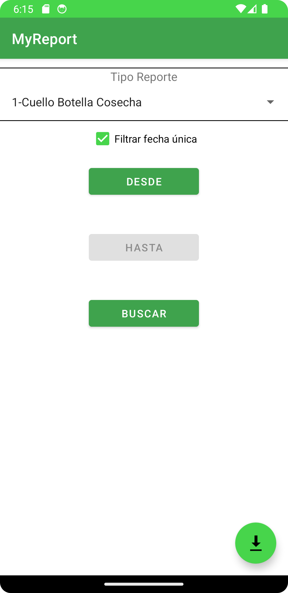
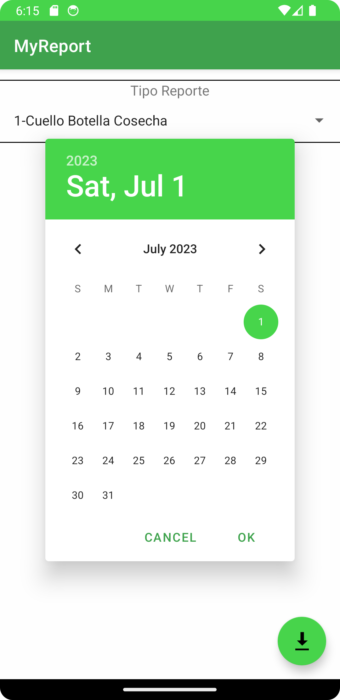

# MyReport
Aplicación android

Capturas de pantalla del módulo de cuellos de botella.
a. Ventana login.

b. Menú lateral.

c. Ventana reporte cuello botella

d. Ventana para buscar por tipo de reporte, por fecha individual o rango de fechas.

e. Datepicker para seleccionar la fecha.

